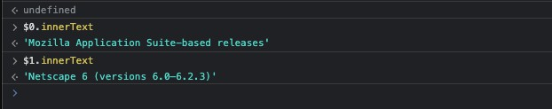

After of a decade using chrome I thought to ask what `== $0` means beside the selected element in the dev console 'Elements' tab:

It's a search reference! So in the console, `$0` will retrieve the most recent element selected, `$1` the next most recent, and so on: 

